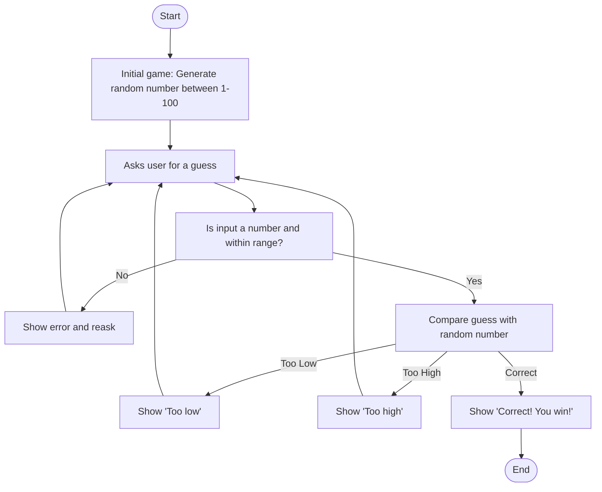

## Description of Each Step
1. **Start** - The game begins
2. **Initial game** - The computer will generate a random number between 1-100
3. **AskUser** - The game will ask the user to enter a number to guess.
4. **Validate** - Makes sure the input is within the 1-100 range. If the user did not put in a number or a number between 1-100 then an error message with pop-up and ask for another guess. If it is valid then the comparison will start.
5. **Show error message and reask** - A message saying, "Invalid response, enter a number between 1-100" will pop-up. 
6. **Compare** - The game will compare the randomly generated number from the computer and the number guess by the player and checks if it lower, higher, or the same.
7. **Too Low** - A message saying, "Guess is too low" will pop-up
8. **Too High** - A message saying, "Guess is too high" will pop-up
9. **Correct** - If the guess matches the computer's number a message saying "You Win!" will pop-up and the game ends.
10. **End** - The game stops after the correct number is guessed. 
